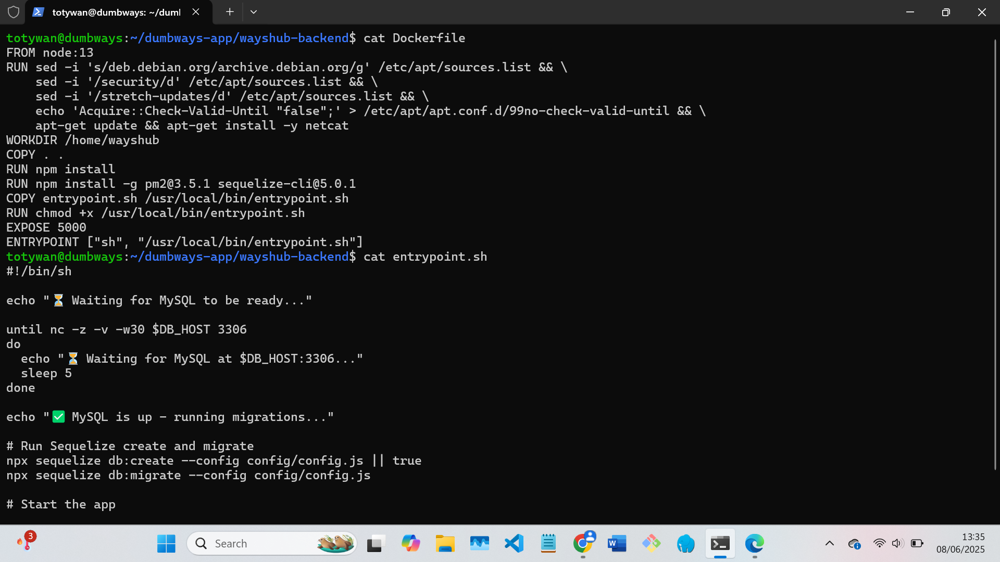

# 📘 TASK WEEK 1 & 2

## Buat image dengan size sekecil mungkin

#### Isi Dokcerfile dari backend awal.



#### 1. Gunakan base minimal (misalnya gunakan node<version>-Alpine karena dilain ukurannya yang minimal juga bekerja dengan baik didalam docker)/dapat juga menggunakan distroless (Tidak ada shell, package manager, tidak bisa exec, hanya runtime. Namun, tidak dianjurkan untuk development)

#### 2. Multi-Stage Build


#### 3. Docker Caching

Karena Docker menggunakan sistem layer (tiap intruksi membuat layer). Karena itu, Docker menyimpan layer tersebut dalam cache dan dapat menggunakannya kembali jika belum berubah.

Karena konsep ini, disarankan untuk menambahkan baris yang digunakan untuk menginstal dependensi & paket lebih awal di dalam Dockerfile - sebelum perintah COPY.
(misalnya: `Copy package\*.json ./`)
Alasan di balik ini adalah bahwa docker akan dapat menyimpan image dengan dependensi yang diperlukan dalam cache, dan cache ini kemudian dapat digunakan dalam build berikutnya saat kode dimodifikasi.

Selain itu, instruksi COPY dan ADD dalam Dockerfile membatalkan cache untuk lapisan berikutnya. Artinya, Docker akan build ulang semua lapisan setelah COPY dan ADD.

Dockerfile1 (Contoh yang Baik)

```bash

FROM ubuntu:latest

ENV DEBIAN_FRONTEND=noninteractive

RUN apt-get update -y && \
apt-get upgrade -y && \
apt-get install -y vim net-tools dnsutils

COPY . .
```

Dockerfile 2 (Contoh yang Kurang Optimal)

```bash
FROM ubuntu:latest

ENV DEBIAN_FRONTEND=noninteractive

COPY . .

RUN apt-get update -y && \
apt-get upgrade -y && \
apt-get install -y vim net-tools dnsutils
```

Docker akan dapat menggunakan fungsionalitas cache lebih baik dengan Dockerfile5 daripada Dockerfile6 karena penempatan COPY yang lebih baik

#### 4. Gunakan docker.ignore apabila masih dalam development dan tidak menggunakan distroless maka di file .dockerignore dapat diikutkan node_modules agar tidak perlu di copy ulang karena instruksi npm install yang ada


#### 5. Meminimalkan Jumlah layer (Image Docker bekerja dengan cara berikut - setiap instruksi RUN, COPY, FROM Dockerfile menambahkan layer baru & setiap layer menambah waktu eksekusi build & meningkatkan penyimpanan image.)


---

## Membuat 2 varian image, dengan varian ke-2 dibuat khusus untuk production (tidak bisa diakses melalui command `docker exec`, image headless dkk)

#### 1. Buat Dockerfile misal disini saya membuat Dockerfile.prod

#### 2. Untuk aplikasi berjalan di production maka baiknya karena hanya menjalankan runtime saja (disini saya menggunakan distroless node:14)

#### 3. Karena distroless tidak dapat menjalankan perintah shell maka isi dari Dockerfile yang mengandung sh diubah


---
