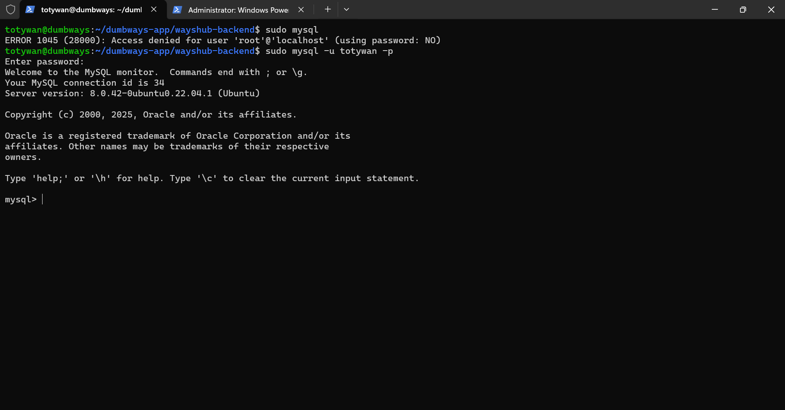
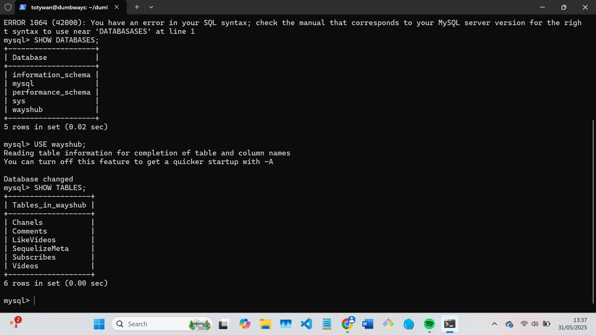
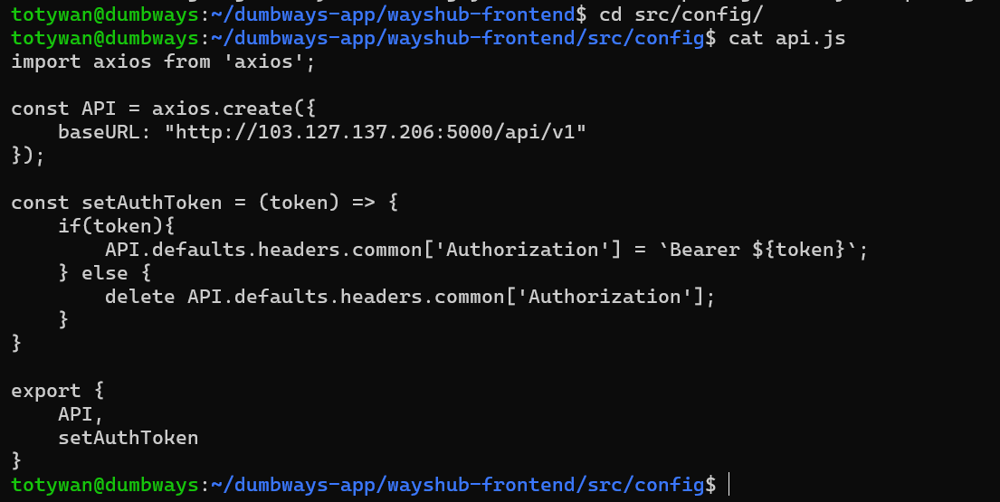
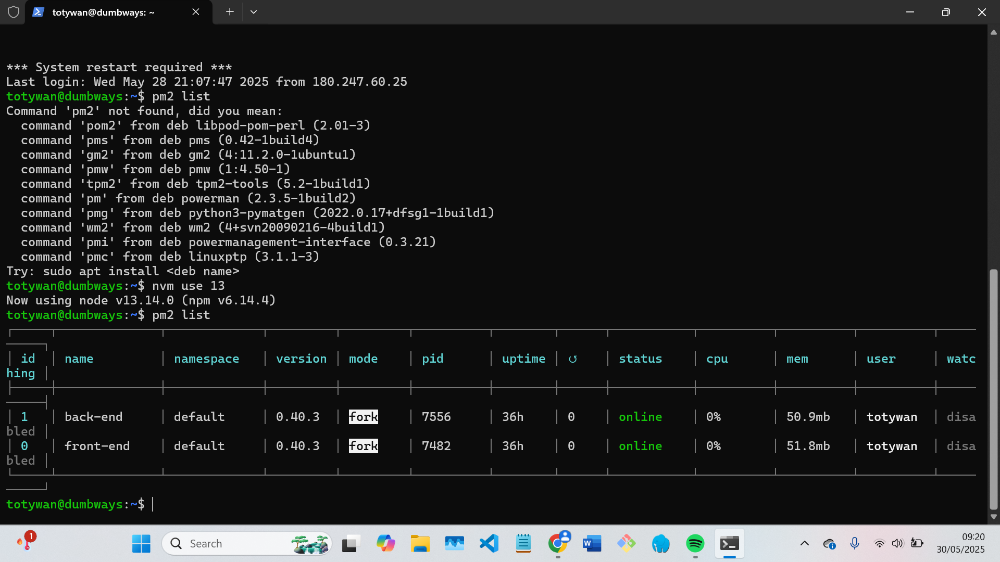
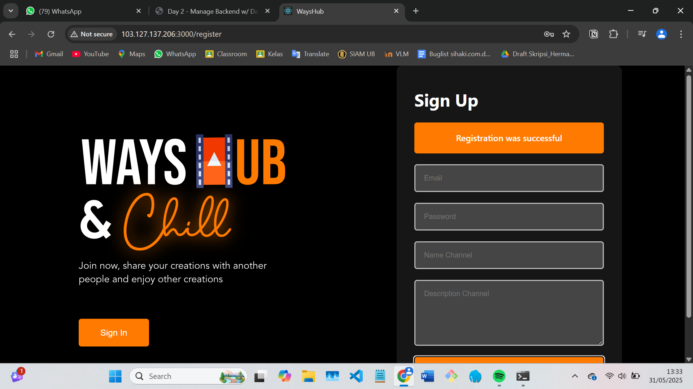
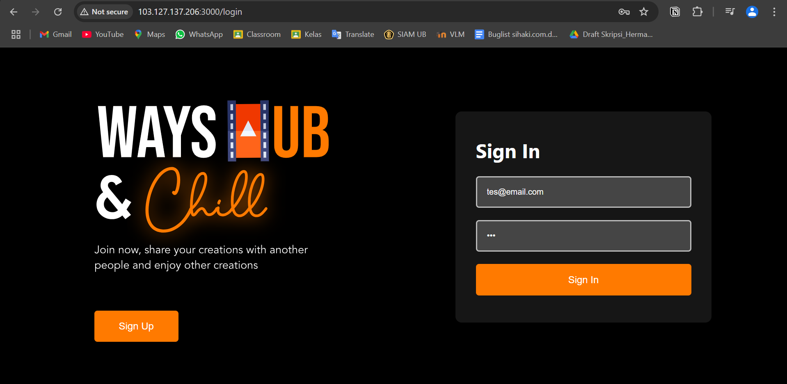
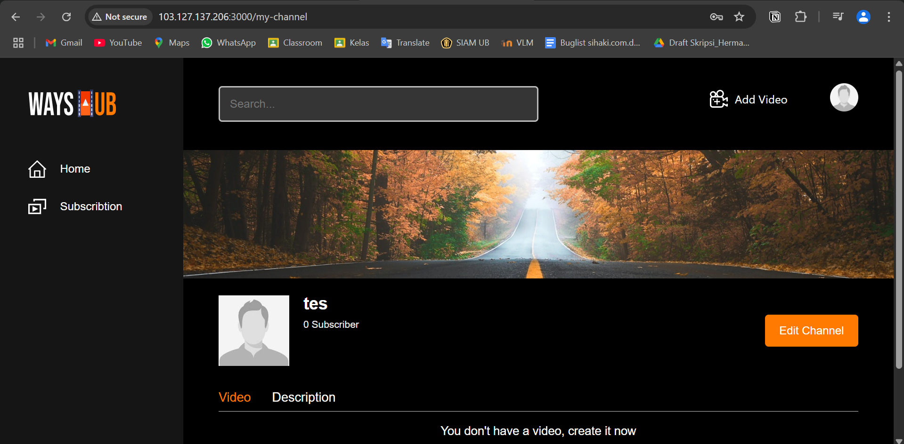

# 📘 TASK WEEK 1 & 2

## - Deploy aplikasi wayshub dengan back-end dan front-end yang berjalan (bisa register datanya di database)

## - Gunakan PM2 untuk manage web app wayshub

### 1. Konfigurasi SSH dan buat server melalui biznetgio

### 2. Clone repositori app wayshub, install PM2 di node versi 13, install mysql-server kemudian lakukan konfigurasi user untuk keamanan akses database.

- Membuat keamanan mysql :
  masuk ke mysql dengan `sudo mysql`:
  `ALTER USER 'root'@'localhost' IDENTIFIED WITH caching_sha2_pass BY 'password';` -> digunakan untuk membuat password dari user root di localhost
  `FLUSH PRIVILIGES;` -> digunakan untuk memuat ulang hak akses (privileges) dari tabel sistem (seperti mysql.user) tanpa perlu me-restart server MySQL.
  buat user -> `CREATE USER 'username'@'%' IDENTIFIED BY 'password';`
  `GRANT ALL PRIVILIGES ON *.* TO 'username'@'%';` -> digunakan untuk memberikan akses seluruh database dan tabel database di dalamnya pada user tertentu
  

### 3. Buat database dengan nama database yang diinginkan kemudian konfigurasikan database tersebut misalnya di app wayshub back-end pada direktori `config/config.json`

### 4. Install sequelize untuk migrasi database `npm i -g sequelize-cli`, pada dependesi aplikasi back end install node module sequelize `npm install sequelize`, initialisasi sequelize `sequelize init`, migrasi database yang ada di app dengan `npm sequelize-cli db:migrate`

### 5. Hubungkan front-end dengan back-end melalui api kemudian manage dan jalankan aplikasi melalui PM2

---
