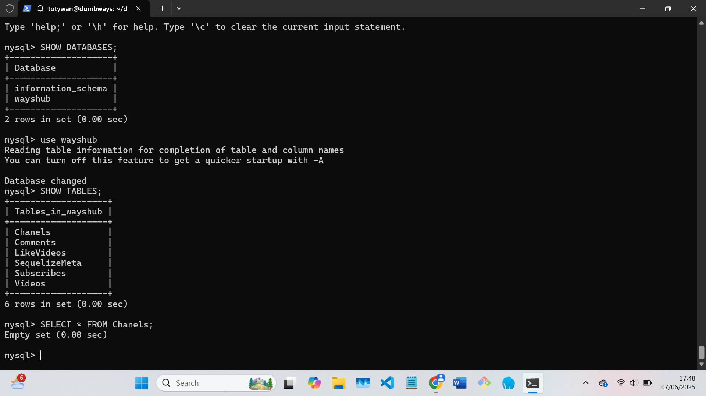
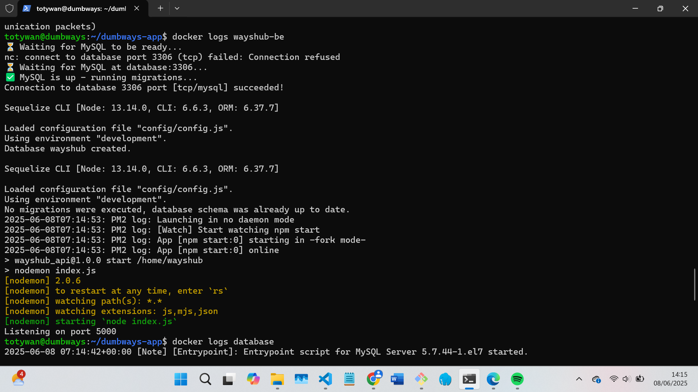

# 📘 Docker Task

## Menjalankan Aplikasi BE, FE dan Database on top `docker compose`

#### 1. Buat Dockerfile untuk BE dan FE kemudian build dengan menggunakan perintah `docker build -t <nama tag sesuai repo docker hub saja biar bisa langsung di push> .`

Back-end Dockerfile

```bash
FROM node:13
RUN sed -i 's/deb.debian.org/archive.debian.org/g' /etc/apt/sources.list && \
    sed -i '/security/d' /etc/apt/sources.list && \
    sed -i '/stretch-updates/d' /etc/apt/sources.list && \
    echo 'Acquire::Check-Valid-Until "false";' > /etc/apt/apt.conf.d/99no-check-valid-until && \
    apt-get update && apt-get install -y netcat
WORKDIR /home/wayshub
COPY . .
RUN npm install
RUN npm install -g pm2@3.5.1 sequelize-cli@5.0.1
COPY entrypoint.sh /usr/local/bin/entrypoint.sh
RUN chmod +x /usr/local/bin/entrypoint.sh
EXPOSE 5000
ENTRYPOINT ["sh", "/usr/local/bin/entrypoint.sh"]
```

entrypoint.sh (menjalankan shell untuk cek koneksi database dan migrasi menggunakan sequelize)

```bash
#!/bin/sh

echo "⏳ Waiting for MySQL to be ready..."

until nc -z -v -w30 $DB_HOST 3306
do
  echo "⏳ Waiting for MySQL at $DB_HOST:3306..."
  sleep 5
done

echo "✅ MySQL is up - running migrations..."

# Run Sequelize create and migrate
npx sequelize db:create --config config/config.js || true
npx sequelize db:migrate --config config/config.js

# Start the app
pm2-runtime ecosystem.config.js
```

Config database di config.js


Front-end Dockerfile

```bash
FROM node:13-alpine
WORKDIR /home/wayshub
COPY . .
RUN npm install
EXPOSE 3000
CMD ["npm","start"]
```

#### 2. Buat file docker-compose.yml untuk mengemas FE, BE dan database agar dapat dijalankan menjadi satu menggunakan docker compose

docker-compose.yml

```bash
version: '3.7'
services:
  frontend:
   container_name: wayshub-fe
   depends_on:
     - backend
   image: totywan/wayshub-frontend13
   stdin_open: true
   ports:
     - 3069:3000
  frontend2:
   container_name: wayshub-fe-2
   depends_on:
     - backend
   image: totywan/wayshub-frontend13
   stdin_open: true
   ports:
     - 3072:3000
  database:
   container_name: database
   image: mysql:5.7
   restart: always
   command: --default-authentication-plugin=mysql_native_password
   healthcheck:
        test: [ "CMD", 'mysqladmin', 'ping', '-h', 'localhost']
        timeout: 5s
        retries: 10
   ports:
     - 3306:3306
   volumes:
     - ~/mysql_data13:/var/lib/mysql
   environment:
     MYSQL_DATABASE: wayshub
     MYSQL_ROOT_PASSWORD: rootpassword
     MYSQL_USER: user
     MYSQL_PASSWORD: password
  backend:
   container_name: wayshub-be
   image: wayshub-backend13
   restart: always
   stdin_open: true
   ports:
      - 5000:5000
   depends_on:
      - database
   environment:
      DB_HOST: database
      DB_USER: user
      DB_PASSWORD: password
      DB_NAME: wayshub
```

#### 3. Jalankan docker compose menggunakan perintah `docker compose up -d`, tes aplikasi dan jangan lupa periksa logs





---
