# 📘 Jenkins Task

- Reverse Proxy Jenkins
  - gunakan domain ex. pipeline-team.studentdumbways.my.id
- Buatlah beberapa Job untuk aplikasi kalian
  - Job Frontend
  - Job Backend
- Buat Jenkinsfile dengan proses seperti ini :
  - Pull dari repository
  - Dockerize/Build aplikasi kita
  - Test application
  - Deploy aplikasi on top Docker
  - Push ke Docker Hub
- Auto trigger setiap ada perubahan di SCM (setiap repository berubah, otomatis menjalankan build)

---

## Reverse Proxy Jenkins

1.  install jenkins (disini saya menggunakan docker dan untuk dokumentasi intall jenkins dapat di lihat di https://www.jenkins.io/doc/book/installing/docker/)
2.  Jika sudah buat akun untuk login ke jenkinsnya (disini saya membuat username: dumbways dan password: dumbways)
    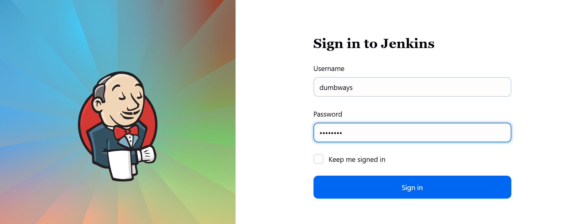
3.  Masuk ke cloudflare dan masukkan subdomain baru misal `pipeline-team.studentdumbways.my.id`
4.  Konfigurasi domain tersebut dengan Nginx dan tambahkan SSL menggunakan wildcard dengan cerbeot (dokumentasi dapat dilihat di https://certbot.eff.org/instructions?ws=nginx&os=snap&tab=wildcard)
5.  apabila mendapati error seperti gambar di bawah saat mengenerate SSL menggunakan wildcard ikuti langkah 6
    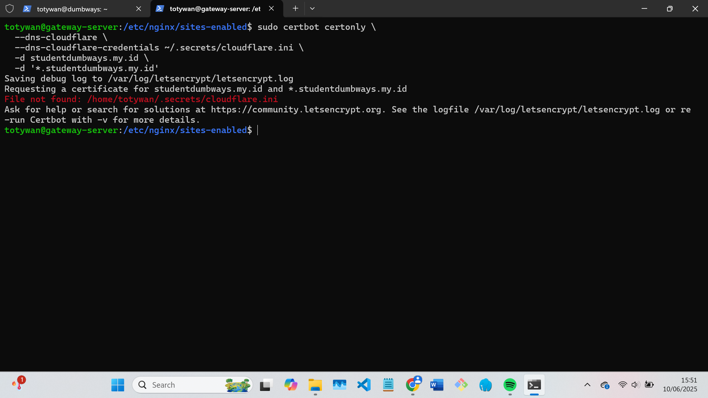
6.  Buat token di cloudflare
    Cara buat token:

        Masuk Cloudflare dashboard

        Menu: My Profile > API Tokens

        Buat token baru dengan template "Edit zone DNS"

        Pilih domain: studentdumbways.my.id

Sain token dan masukkan token ke file dan format isi file dibawah

```bash
mkdir -p ~/.secrets
nano ~/.secrets/cloudflare.ini
dns_cloudflare_api_token = TOKEN_KAMU
```

beri permission agar tidak dibaca sembarangan

```bash
chmod 600 ~/.secrets/cloudflare.ini

```

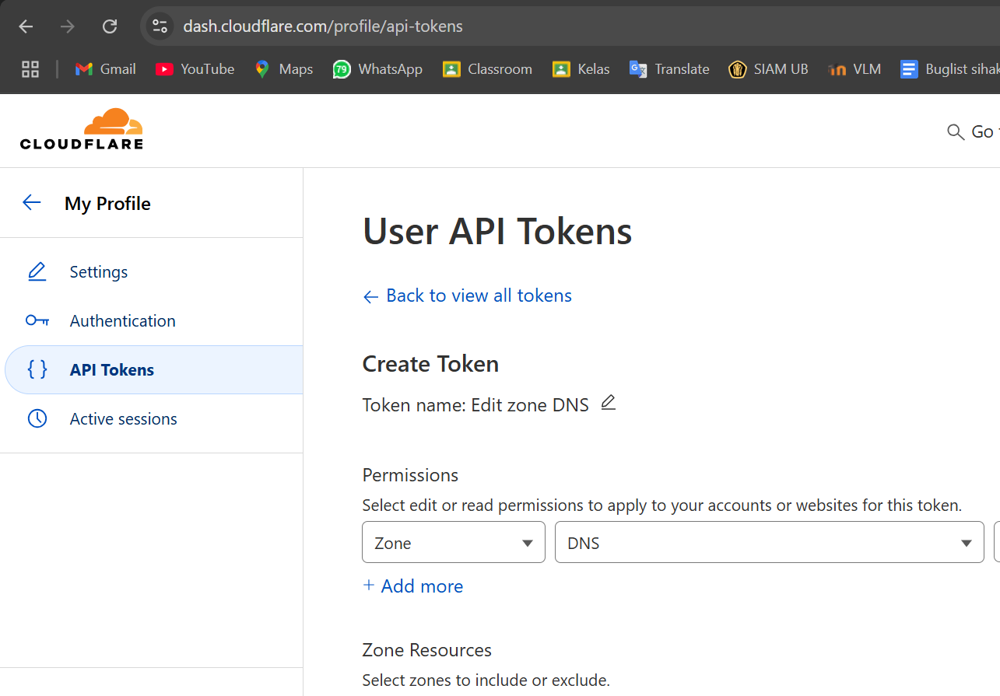
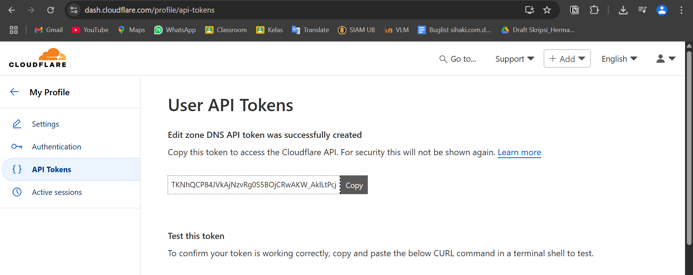
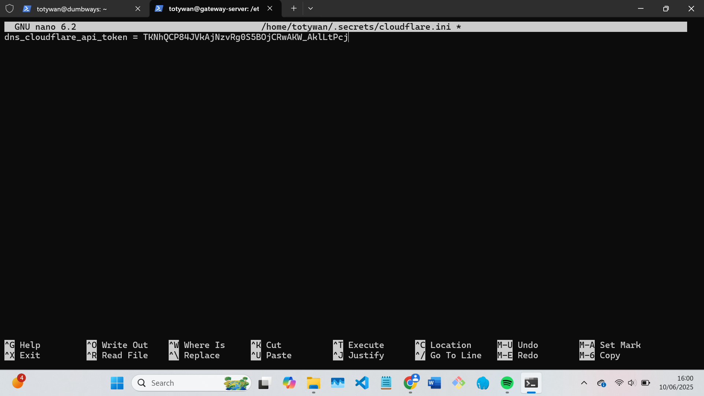
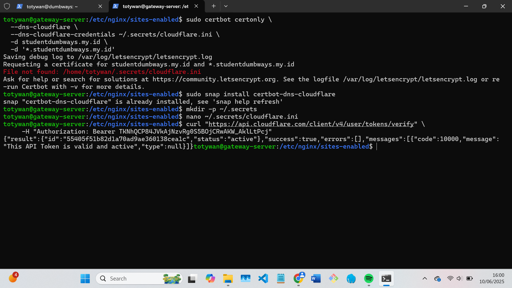

7. Setelah berhasil, file SSL akan ada di `/etc/letsencrypt/live/studentdumbways.my.id/`
8. Pasang di nginx dan konfigurasi seperti ini (untuk dokumentasi konfigurasi dapat dilihat di https://www.jenkins.io/doc/book/system-administration/reverse-proxy-configuration-with-jenkins/reverse-proxy-configuration-nginx/)

```bash
upstream jenkins {
  keepalive 32; # keepalive connections
  server 103.127.137.206:8080; # jenkins ip and port
}

# Required for Jenkins websocket agents
map $http_upgrade $connection_upgrade {
  default upgrade;
  '' close;
}

server {
    listen 443 ssl;

    ssl_certificate /etc/letsencrypt/live/studentdumbways.my.id/fullchain.pem;
    ssl_certificate_key /etc/letsencrypt/live/studentdumbways.my.id/privkey.pem;

    location / {
         sendfile off;
         proxy_pass http://jenkins;
         proxy_redirect     default;
         proxy_http_version 1.1;

         # Required for Jenkins websocket agents
         proxy_set_header   Connection        $connection_upgrade;
         proxy_set_header   Upgrade           $http_upgrade;

         proxy_set_header   Host              $http_host;
         proxy_set_header   X-Real-IP         $remote_addr;
         proxy_set_header   X-Forwarded-For   $proxy_add_x_forwarded_for;
         proxy_set_header   X-Forwarded-Proto $scheme;
         proxy_max_temp_file_size 0;

         #this is the maximum upload size
         client_max_body_size       10m;
         client_body_buffer_size    128k;

         proxy_connect_timeout      90;
         proxy_send_timeout         90;
         proxy_read_timeout         90;
         proxy_request_buffering    off; # Required for HTTP CLI commands
    }
}
server {
    listen 80;
    server_name pipeline-team.studentdumbways.my.id;

    # Redirect all HTTP to HTTPS
    return 301 https://$host$request_uri;
  # this is the jenkins web root directory
  # (mentioned in the output of "systemctl cat jenkins")
    root            /var/cache/jenkins/war/;

    access_log      /var/log/nginx/jenkins.access.log;
    error_log       /var/log/nginx/jenkins.error.log;

  # pass through headers from Jenkins that Nginx considers invalid
    ignore_invalid_headers off;

    location ~ "^\/static\/[0-9a-fA-F]{8}\/(.*)$" {
    # rewrite all static files into requests to the root
    # E.g /static/12345678/css/something.css will become /css/something.css
    rewrite "^\/static\/[0-9a-fA-F]{8}\/(.*)" /$1 last;
  }

    location /userContent {
    # have nginx handle all the static requests to userContent folder
    # note : This is the $JENKINS_HOME dir
    root /var/lib/jenkins/;
    if (!-f $request_filename){
      # this file does not exist, might be a directory or a /**view** url
      rewrite (.*) /$1 last;
      break;
    }
    sendfile on;
  }
}

```

---

## Buat job

1. Konfigurasikan credential SSH untuk akun github dan jenkins.
2. Pasang private key ke jenkins dan public key untuk github.
3. Setelah selesai buat job pipeline dan konfigurasi sesuai dengan repo github yang di remote
   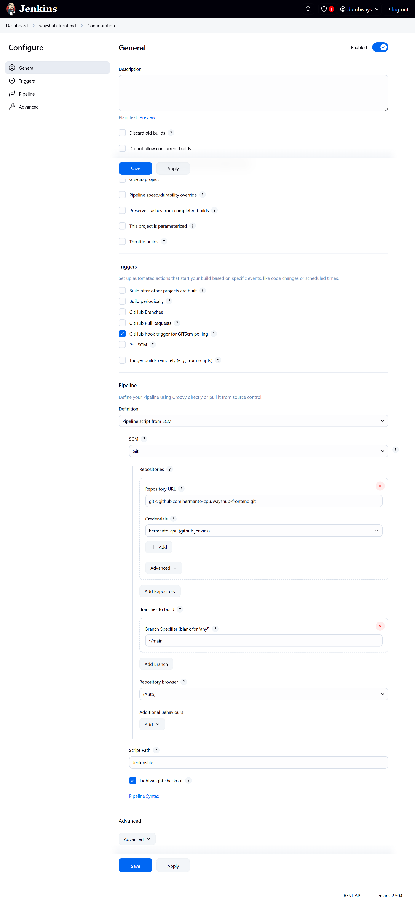
   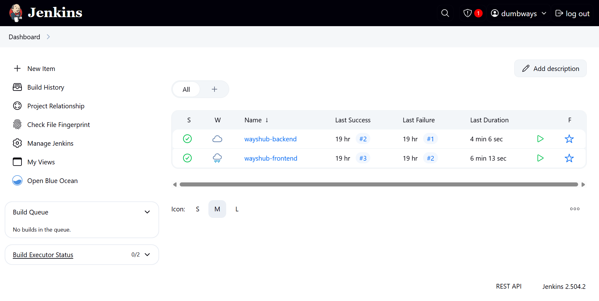

---

## Buat Jenkinsfile yang melakukan pull dari repository, dockerize/build aplikasi kita, test application, deploy aplikasi on top Docker, push ke Docker Hub

1. Buat Jenkinsfile pada repo yang ter-remote dengan job di Jenkins
   Jenkinsfile Front-end:

```bash
def secret = 'totywan-vps'
def server = 'totywan@103.127.137.206'
def directory = '/home/totywan/dumbways-app/wayshub-frontend'
def branch = 'main'
def image = 'totywan/wayshub-frontend13:1.0'

pipeline {
    agent any
    environment {
        DOCKERHUB_CRED = 'totywan-dockerhub'
    }
    stages {
        stage ('Pull Latest Code from GitHub') {
            steps {
                sshagent([secret]) {
                    sh """
                        ssh -o StrictHostKeyChecking=no ${server} << EOF
                            cd ${directory}
                            git pull origin ${branch}
                            echo "✅ Pulled latest code"
                            exit
                        EOF
                    """
                }
            }
        }

        stage ('Build Docker Image on VPS') {
            steps {
                sshagent([secret]) {
                    sh """
                        ssh -o StrictHostKeyChecking=no ${server} << EOF
                            cd ${directory}
                            docker build -t ${image} .
                            echo "✅ Image built successfully"
                            exit
                        EOF
                    """
                }
            }
        }


        stage ('Push to Docker Hub') {
            steps {
                sshagent([secret]) {
                    withCredentials([usernamePassword(credentialsId: "${DOCKERHUB_CRED}", usernameVariable: 'DOCKER_USER', passwordVariable: 'DOCKER_PASS')]) {
                        sh """
                            ssh -o StrictHostKeyChecking=no ${server} << EOF
                                echo $DOCKER_PASS | docker login -u $DOCKER_USER --password-stdin
                                docker push ${image}
                                echo "📦 Image pushed ke Docker Hub"
                                exit
                            EOF
                        """
                    }
                }
            }
        }

        stage ('Deploy Container on VPS') {
            steps {
                sshagent([secret]) {
                    sh """
                        ssh -o StrictHostKeyChecking=no ${server} << EOF
                            docker stop wayshub-fe || true
                            docker rm wayshub-fe || true
                            docker run -d --name wayshub-fe -p 3000:3000 ${image}
                            echo "🚀 Deployed frontend!"
                            exit
                        EOF
                    """
                }
            }
        }
    }
}
```

Jenkinsfile Back-end:

```bash
def secret = 'totywan-vps'
def server = 'totywan@103.127.137.206'
def directory = '/home/totywan/dumbways-app/wayshub-backend'
def branch = 'main'
def image = 'totywan/wayshub-frontend13:1.0'

pipeline {
    agent any
    environment {
        DOCKERHUB_CRED = 'totywan-dockerhub'
    }
    stages {
        stage ('Pull Latest Code from GitHub') {
            steps {
                sshagent([secret]) {
                    sh """
                        ssh -o StrictHostKeyChecking=no ${server} << EOF
                            cd ${directory}
                            git pull origin ${branch}
                            echo "✅ Pulled latest code"
                            exit
                        EOF
                    """
                }
            }
        }

        stage ('Build Docker Image on VPS') {
            steps {
                sshagent([secret]) {
                    sh """
                        ssh -o StrictHostKeyChecking=no ${server} << EOF
                            cd ${directory}
                            docker build -t ${image} .
                            echo "✅ Image built successfully"
                            exit
                        EOF
                    """
                }
            }
        }


        stage ('Push to Docker Hub') {
            steps {
                sshagent([secret]) {
                    withCredentials([usernamePassword(credentialsId: "${DOCKERHUB_CRED}", usernameVariable: 'DOCKER_USER', passwordVariable: 'DOCKER_PASS')]) {
                        sh """
                            ssh -o StrictHostKeyChecking=no ${server} << EOF
                                echo $DOCKER_PASS | docker login -u $DOCKER_USER --password-stdin
                                docker push ${image}
                                echo "📦 Image pushed ke Docker Hub"
                                exit
                            EOF
                        """
                    }
                }
            }
        }

        stage ('Deploy Container on VPS') {
            steps {
                sshagent([secret]) {
                    sh """
                        ssh -o StrictHostKeyChecking=no ${server} << EOF
                            docker stop wayshub-be || true
                            docker rm wayshub-be || true
                            docker run -d --name wayshub-be -p 5000:5000 ${image}
                            echo "🚀 Deployed Backend!"
                            exit
                        EOF
                    """
                }
            }
        }
    }
}
```

## Auto trigger tiap ada perubahan di SCM

1. Set Webhook di GitHub ke Jenkins:

- GitHub → Settings repo → Webhooks → Tambah webhook

- URL: http://<domain-atau-IP-Jenkins>/github-webhook/

- Pilih: Just the push event

- Content type: application/json
- Save
  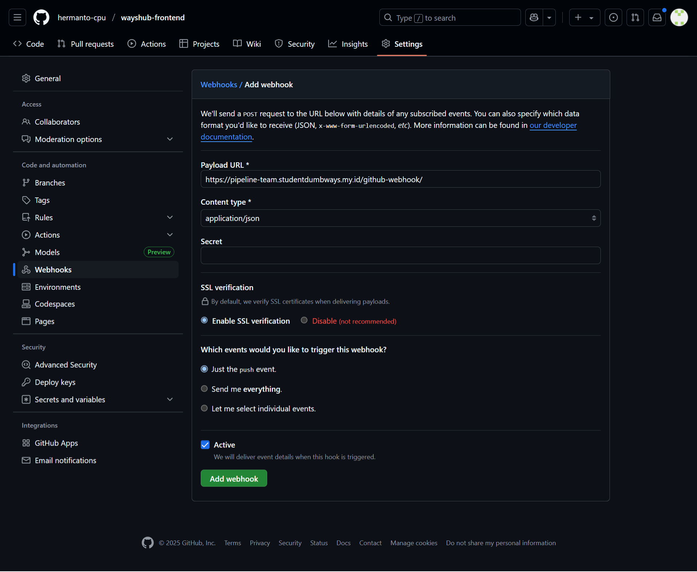

2. Ceklis GitHub hook trigger for GITScm polling pada konfigurasi job Jenkins
   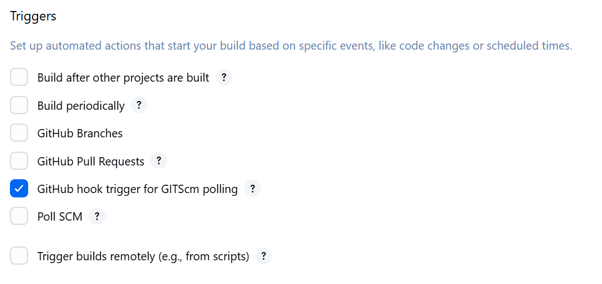

3. Selesai, tiap perubahan dari repository github akan otomatis di build oleh job pipeline
   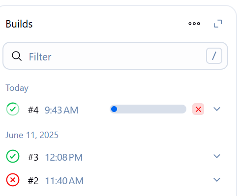

---
