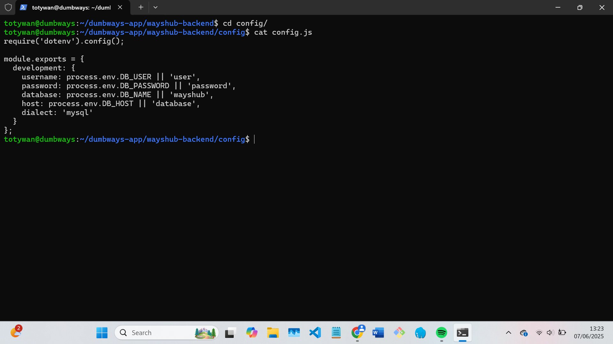
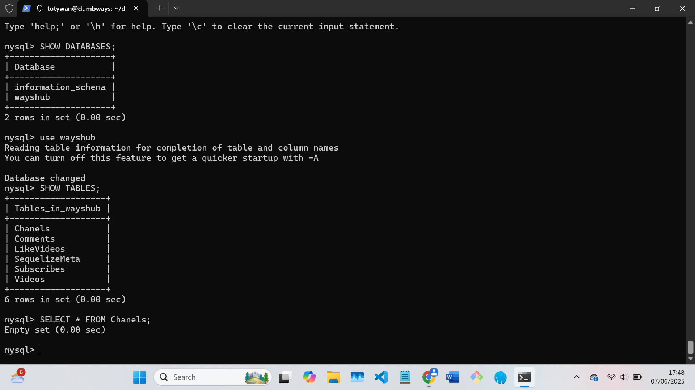
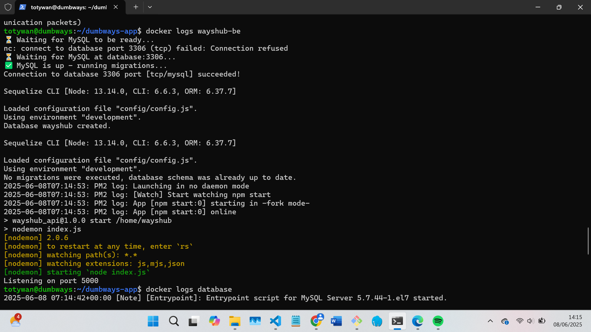
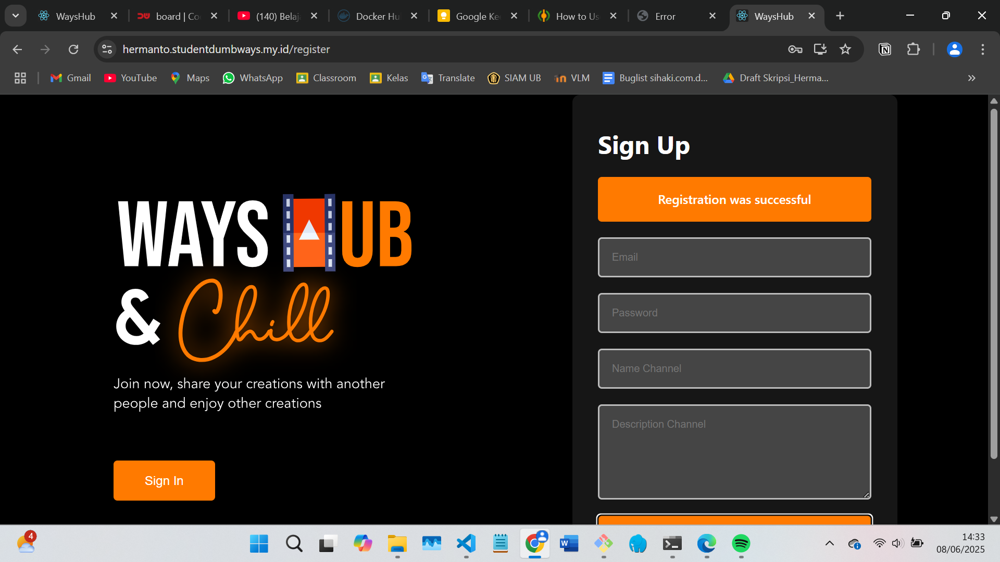

# 📘 Docker Task

- Rebuild ulang server BiznetGio kalian, lalu gunakan username "dumbways" yang kalian gunakan bersama, pastikan menggunakan login melalui ssh-key dan bukan password. (1 key untuk semua akan menjadi bonus)

- Deploy aplikasi Web Server, Frontend, Backend, serta Database on top `docker compose`

- Di dalam docker-compose file buat suatu custom network dengan nama **team kalian**, lalu pasang ke setiap service yang kalian miliki. (Nilai Bonus)

  - Untuk Web Server buatlah configurasi reverse-proxy menggunakan nginx on top docker.
    - **SSL CLOUDFLARE OFF!!!**
    - Gunakan docker volume untuk membuat reverse proxy
    - SSL sebisa mungkin gunakan wildcard
    - Untuk DNS bisa sesuaikan seperti contoh di bawah ini
      - Frontend team.studentdumbways.my.id
      - Backend api.team.studentdumbways.my.id
  - Push image ke docker registry kalian masing".

- Aplikasi dapat berjalan dengan sesuai seperti melakukan login/register.

## Rebuild Server Biznet

1. Login ke biznet lalu pilih server yang ingin di rebuild
2. Stop server kemudian klik rebuild dan pilih OS yang ingin digunakan.
3. Tunggu proses rebuildnya selesai

## Menjalankan Aplikasi BE, FE dan Database on top `docker compose`

#### 1. Buat Dockerfile untuk BE dan FE kemudian build dengan menggunakan perintah `docker build -t <nama tag sesuai repo docker hub saja biar bisa langsung di push> .`

Back-end Dockerfile

```bash
FROM node:13
RUN sed -i 's/deb.debian.org/archive.debian.org/g' /etc/apt/sources.list && \
    sed -i '/security/d' /etc/apt/sources.list && \
    sed -i '/stretch-updates/d' /etc/apt/sources.list && \
    echo 'Acquire::Check-Valid-Until "false";' > /etc/apt/apt.conf.d/99no-check-valid-until && \
    apt-get update && apt-get install -y netcat
WORKDIR /home/wayshub
COPY . .
RUN npm install
RUN npm install -g pm2@3.5.1 sequelize-cli@5.0.1
COPY entrypoint.sh /usr/local/bin/entrypoint.sh
RUN chmod +x /usr/local/bin/entrypoint.sh
EXPOSE 5000
ENTRYPOINT ["sh", "/usr/local/bin/entrypoint.sh"]
```

entrypoint.sh (menjalankan shell untuk cek koneksi database dan migrasi menggunakan sequelize)

```bash
#!/bin/sh

echo "⏳ Waiting for MySQL to be ready..."

until nc -z -v -w30 $DB_HOST 3306
do
  echo "⏳ Waiting for MySQL at $DB_HOST:3306..."
  sleep 5
done

echo "✅ MySQL is up - running migrations..."

# Run Sequelize create and migrate
npx sequelize db:create --config config/config.js || true
npx sequelize db:migrate --config config/config.js

# Start the app
pm2-runtime ecosystem.config.js
```

Config database di config.js


Front-end Dockerfile

```bash
FROM node:13-alpine
WORKDIR /home/wayshub
COPY . .
RUN npm install
EXPOSE 3000
CMD ["npm","start"]
```

#### 2. Buat file docker-compose.yml untuk mengemas FE, BE dan database agar dapat dijalankan menjadi satu menggunakan docker compose

docker-compose.yml

```bash
version: '3.7'
services:
  frontend:
   container_name: wayshub-fe
   depends_on:
     - backend
   image: totywan/wayshub-frontend13
   stdin_open: true
   ports:
     - 3000:3000
  frontend2:
   container_name: wayshub-fe-2
   depends_on:
     - backend
   image: totywan/wayshub-frontend13
   stdin_open: true
   ports:
     - 3069:3000
  database:
   container_name: database
   image: mysql:5.7
   restart: always
   command: --default-authentication-plugin=mysql_native_password
   healthcheck:
        test: [ "CMD", 'mysqladmin', 'ping', '-h', 'localhost']
        timeout: 5s
        retries: 10
   ports:
     - 3306:3306
   volumes:
     - ~/mysql_data13:/var/lib/mysql
   environment:
     MYSQL_DATABASE: wayshub
     MYSQL_ROOT_PASSWORD: rootpassword
     MYSQL_USER: user
     MYSQL_PASSWORD: password
  backend:
   container_name: wayshub-be
   image: wayshub-backend13
   restart: always
   stdin_open: true
   ports:
      - 5000:5000
   depends_on:
      - database
   environment:
      DB_HOST: database
      DB_USER: user
      DB_PASSWORD: password
      DB_NAME: wayshub
```

#### 3. Jalankan docker compose menggunakan perintah `docker compose up -d`, tes aplikasi dan jangan lupa periksa logs





---

## Push Docker Image ke repo dockerhub

1. pada shell login dahulu ke dockerhub `docker login`
2. login ke dockerhub dan buat repo dengan nama image misal wayshub-backend
3. jika nama image yang ingin di push sudah sesuai dengan repo di dockerhub (misal: totywan/wayshub-backend), maka bisa langsung dengan perintah `docker push totywan/wayshub-backend`
4. jika belum bisa menggunakan `docker image <nama-image>:tag <nama-repo>`

## Reverse Proxy dengan Nginx menggunakan Docker + Volume

1. 1. Konfigurasi `nginx` (reverse proxy)

Buat file `nginx/conf.d/rproxyfe.conf`:

```nginx
server {
    server_name hermanto.studentdumbways.my.id;

    location / {
        proxy_pass http://103.127.137.206:3000;
    }

    listen 443 ssl;
    ssl_certificate /etc/letsencrypt/live/hermanto.studentdumbways.my.id/fullchain.pem;
    ssl_certificate_key /etc/letsencrypt/live/hermanto.studentdumbways.my.id/privkey.pem;
    include /etc/letsencrypt/options-ssl-nginx.conf;
    ssl_dhparam /etc/letsencrypt/ssl-dhparams.pem;
}

server {
    if ($host = hermanto.studentdumbways.my.id) {
        return 301 https://$host$request_uri;
    }

    server_name hermanto.studentdumbways.my.id;
    listen 80;
    return 404;
}
```

2. dapat ditambahkan service didalam docker compose misalnya seperti ini

```bash
services:
  nginx:
    image: nginx:alpine
    container_name: reverse-proxy
    volumes:
      - ./nginx/conf.d:/etc/nginx/conf.d
      - ./nginx/ssl:/etc/letsencrypt    # volume untuk SSL
    ports:
      - "80:80"
      - "443:443"
    depends_on:
      - frontend
```

3. Generate SSL dengan cerbot

```bash
sudo apt install certbot python3-certbot-nginx
sudo certbot certonly --nginx -d hermanto.studentdumbways.my.id

```

4. SSL akan tersimpan di /etc/letsencrypt kemudian copy `sudo cp -r /etc/letsencrypt ./nginx/ssl`
5. setelah selesai jalankan `docker compose up -d`
