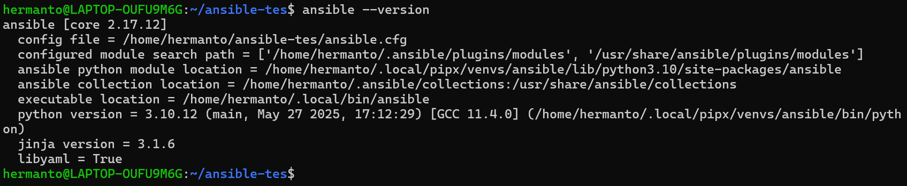
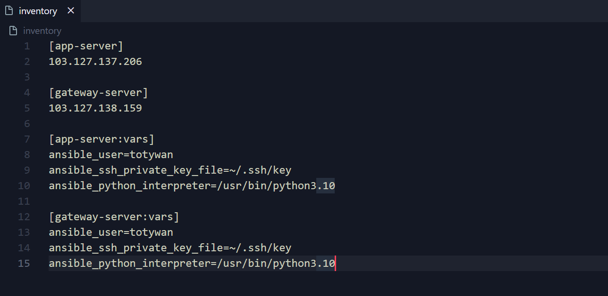
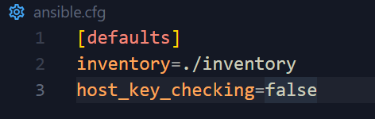
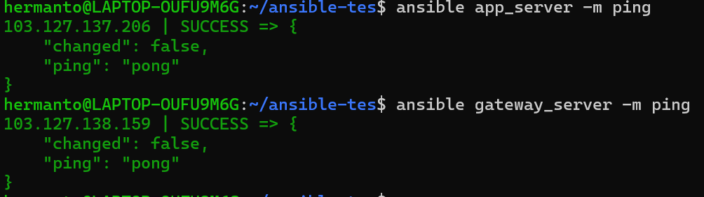
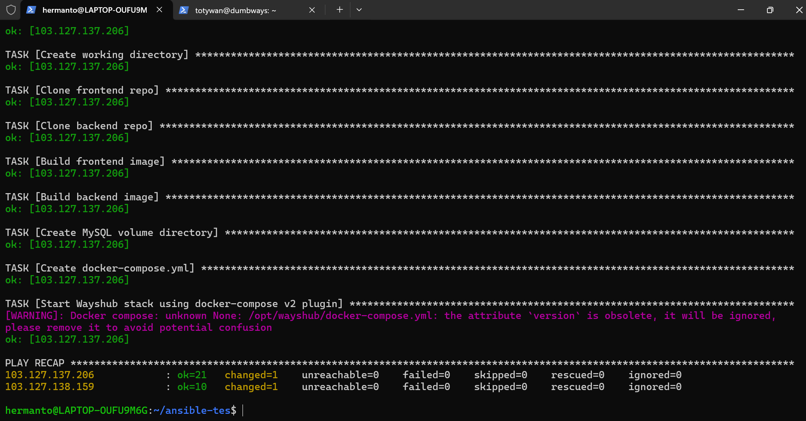
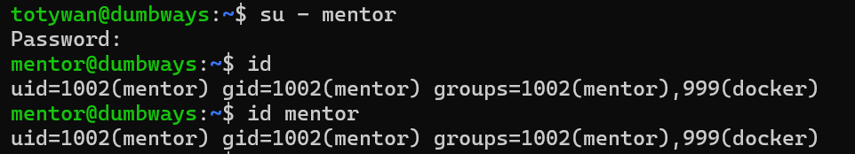
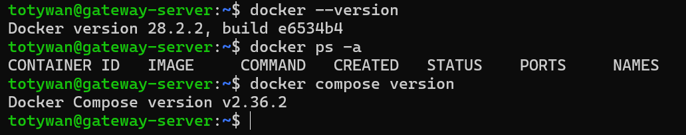
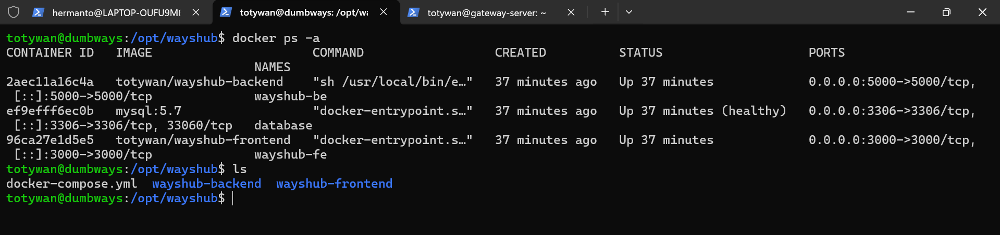

# 📘 Ansible Task

- Install docker
- membuat user baru (nama user mentor) dengan home
- Menjalankan aplikasi wayshub (frontend+backend+db dengan compose docker)

---

## 🚀 Install Docker via Ansible

1. Install Ansible terlebih dahulu ([Installing Ansible](https://docs.ansible.com/ansible/latest/installation_guide/intro_installation.html))

- Ansible berjalan diatas bahasa pemrograman python, jadi pastikan sudah menginstall python. Berdasarkan dokumentasi Ansible saat ini, versi Python yang disarankan adalah minimal 3.9
- Apabila ingin install Ansible di windows, Ansible menyarankan untuk menggunakan WSL

2.  Cek apakah ansible sudah terinstal dengan `ansible --version`
    
3.  Setelah itu, buat ssh key di WSL untuk connect ke server lalu masukkan konfigurasi ke file inventory termasuk juga host server yang ingin di-manage menggunakan ansible
    
4.  Buat file ansible.cfg untuk mengkonfigurasi behavior Ansible saat kita menjalankan perintah-perintah ansible
    
    - host_key_checking digunakan untuk menghindari host key checking saat pertama kali connect ke server baru
5.  Cek apakah server dapat terkoneksi dengan Ansible menggunakan module ping menggunakan ad hoc command (perintah tidak berulang)
    
6.  Buat file `.yml` yang berisikan task menginstall docker, membuat user baru bernama mentor dengan home, menjalankan aplikasi wayshub dengan docker compose

```yml
---
- name: Setup server
  hosts: gateway_server, app_server
  become: true
  tasks:
    - name: Install dependency packages
      apt:
        name:
          - apt-transport-https
          - ca-certificates
          - curl
          - gnupg
          - lsb-release
        state: present
        update_cache: yes

    - name: Add Docker GPG key
      apt_key:
        url: https://download.docker.com/linux/ubuntu/gpg
        state: present

    - name: Add Docker APT repository
      apt_repository:
        repo: "deb [arch=amd64] https://download.docker.com/linux/ubuntu {{ ansible_distribution_release }} stable"
        state: present

    - name: Install Docker Engine
      apt:
        name:
          - docker-ce
          - docker-ce-cli
          - containerd.io
        state: latest

    - name: Enable and start Docker service
      systemd:
        name: docker
        enabled: true
        state: started

    - name: Create user 'mentor' with home directory
      user:
        name: mentor
        comment: "Mentor user"
        shell: /bin/bash
        create_home: true

    - name: Add 'mentor' user to docker group
      user:
        name: mentor
        groups: docker
        append: yes
    - name: Add 'totywan' user to docker group
      user:
        name: totywan
        groups: docker
        append: yes

    - name: Set password for user 'mentor'
      user:
        name: mentor
        password: "{{ 'Mentor123' | password_hash('sha512') }}"

- name: Deploy Wayshub App on app_server
  hosts: app_server
  become: true
  vars:
    frontend_repo: https://github.com/hermanto-cpu/wayshub-frontend.git
    backend_repo: https://github.com/hermanto-cpu/wayshub-backend.git
    project_root: /opt/wayshub
    frontend_dir: /opt/wayshub/frontend
    backend_dir: /opt/wayshub/backend
    compose_file: /opt/wayshub/docker-compose.yml

  tasks:
    - name: Ensure git is installed
      apt:
        name: git
        state: present
        update_cache: yes

    - name: Ensure docker-compose plugin is installed (compose v2)
      apt:
        name:
          - docker-compose-plugin
        state: present

    - name: Create working directory
      file:
        path: "{{ project_root }}"
        state: directory
        mode: "0755"

    - name: Clone frontend repo
      git:
        repo: "{{ frontend_repo }}"
        dest: "{{ frontend_dir }}"
        version: main

    - name: Clone backend repo
      git:
        repo: "{{ backend_repo }}"
        dest: "{{ backend_dir }}"
        version: main

    - name: Build frontend image
      community.docker.docker_image:
        name: totywan/wayshub-frontend
        build:
          path: "{{ frontend_dir }}"
        source: build

    - name: Build backend image
      community.docker.docker_image:
        name: totywan/wayshub-backend
        build:
          path: "{{ backend_dir }}"
        source: build

    - name: Create MySQL volume directory
      file:
        path: "/home/totywan/mysql-data-ansible"
        state: directory
        owner: totywan
        group: totywan
        mode: "0755"

    - name: Create docker-compose.yml
      copy:
        dest: "{{ project_root }}/docker-compose.yml"
        content: |
          version: '3.7'
          services:
            frontend:
              container_name: wayshub-fe
              image: totywan/wayshub-frontend
              stdin_open: true
              ports:
                - "3000:3000"

            database:
              container_name: database
              image: mysql:5.7
              restart: always
              command: --default-authentication-plugin=mysql_native_password
              healthcheck:
                test: [ "CMD", "mysqladmin", "ping", "-h", "localhost" ]
                timeout: 5s
                retries: 10
              ports:
                - "3306:3306"
              volumes:
                - "/home/totywan/mysql-data-ansible:/var/lib/mysql"
              environment:
                MYSQL_DATABASE: wayshub
                MYSQL_ROOT_PASSWORD: rootpassword
                MYSQL_USER: user
                MYSQL_PASSWORD: password

            backend:
              container_name: wayshub-be
              image: totywan/wayshub-backend
              restart: always
              stdin_open: true
              ports:
                - "5000:5000"
              depends_on:
                - database
              environment:
                DB_HOST: database
                DB_USER: user
                DB_PASSWORD: password
                DB_NAME: wayshub

    - name: Start Wayshub stack using docker-compose v2 plugin
      community.docker.docker_compose_v2:
        project_src: "{{ project_root }}"
        state: present
```

7. Jalankan `ansible-playbook <file-playbook>`
   

8. Lakukan cek di kedua server, apakah task berhasil dijalankan sesuai instruksi di kedua server.

- `su - mentor` lalu masukkan password `Mentor123`, bisa juga dengan perintah `id mentor` untuk mengecek apakah terdapat user dengan nama mentor
  
- cek apakah docker terinstall dengan docker --version atau docker ps -a
  
- untuk di host app_server cek apakah wayshub berhasil dijalankan dan cek direktori aplikasi
  
