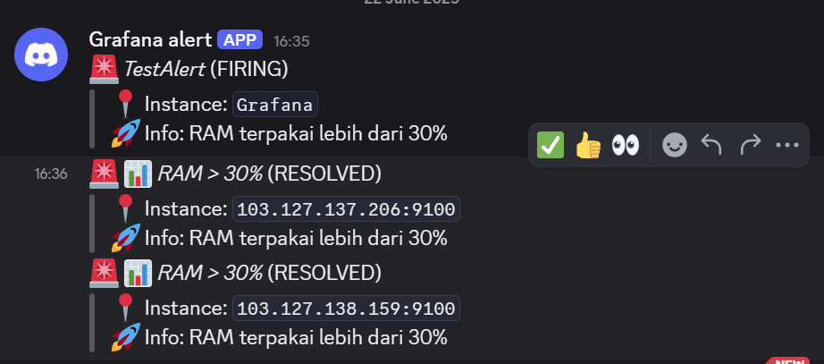

# 📘 Grafana Task

- Menjalankan semua app monitoring via ansible + docker
- Setting prometheus : Job = dw-devops-23; monitor server app dan gateway
- Dashboard grafana menggunakan template
- Alerting untuk : CPU diatas 20%, RAM diatas 30%

---

## ✅Menjalankan semua app monitoring via ansible + docker

1.  Buat folder monitoring untuk menyimpan konfigurasi dan beberapa service yang akan dihandle menggunakan docker compose melalui ansible.
    
    

2.  Setelah itu buat file `monitoring.yml` yang berisi task untuk dijalankan menggunakan `ansible-playbook`

```yml
- name: Setup Monitoring
  hosts: app_server,gateway_server
  become: true
  vars:
    locale: ./monitoring
    remote: /home/mentor/monitoring
  tasks:
    - name: Buat direktori monitoring di server
      file:
        path: "{{ remote }}"
        state: directory

    - name: Copy node-exporter.yml ke remote
      copy:
        src: "{{ locale }}/node-exporter.yml"
        dest: "{{ remote }}/node-exporter.yml"

    - name: Jalankan node-exporter dengan docker compose
      community.docker.docker_compose_v2:
        files:
          - node-exporter.yml
        project_name: monitoring
        project_src: "{{ remote }}"

- name: Setup Prometheus hanya di app_server
  hosts: app_server
  become: true
  vars:
    locale: ./monitoring
    remote: /home/mentor/monitoring
  tasks:
    - name: Salin docker-compose prometheus.yml ke remote
      copy:
        src: "{{ locale }}/prometheus.yml"
        dest: "{{ remote }}/prometheus.yml"

    - name: Salin config prometheus.yml ke folder prometheus
      copy:
        src: "{{ locale }}/prometheus/prometheus.yml"
        dest: "{{ remote }}/prometheus/prometheus.yml"

    - name: Salin folder prometheus secara lengkap
      copy:
        src: "{{ locale }}/prometheus"
        dest: "{{ remote }}/prometheus"
        mode: "0755"

    - name: Jalankan prometheus
      community.docker.docker_compose_v2:
        files:
          - prometheus.yml
        project_name: monitoring
        project_src: "{{ remote }}"

- name: Jalankan Grafana di gateway_server saja
  hosts: gateway_server
  become: true
  vars:
    locale: ./monitoring
    remote: /home/mentor/monitoring
  tasks:
    - name: Copy grafana.yml ke remote
      copy:
        src: "{{ locale }}/grafana.yml"
        dest: "{{ remote }}/grafana.yml"

    - name: Jalankan Grafana
      community.docker.docker_compose_v2:
        files:
          - grafana.yml
        project_name: monitoring
        project_src: "{{ remote }}"
```

3.  Jalankan `ansible-playbook monitoring.yml`
    

4.  Cek apakah task berjalan dengan baik (disini saya menjalankan prometheus di app server dan grafana di gateway server)
    
    
    
    
5.  Di Grafana masukkan data source prometheus dan IP beserta port yang menjalankan Prometheus untuk menangkap data metrics dari node-exporter.
    
    

## ✅Buat dashboard grafana menggunakan template

1. Masuk ke template node exporter full
2. Copy id dashboard `1860`
3. Masukkan ID tersebut pada bagian Import a dashboard kemudian load
4. Pilih data source Prometheus dengan IP & port yang sudah di set sebelumnya
5. Import
   

## 🚨Buat alerting untuk : CPU diatas 20%, RAM diatas 30% (notif melalui discord)

1.  Buka Discord

2.  Klik server → Edit Server → Integrations

3.  Klik Webhooks → New Webhook

4.  Beri nama (misal: Grafana Alert) → pilih channel → Copy Webhook URL

5.  Simpan webhook URL untuk di paste di contact point


6.  Buka Grafana > Alerting > Contact points

7.  Klik New contact point

        Isi:

        - Name: Discord

        - Integration: Webhook

        - URL: tempelkan webhook Discord tadi

        - Tes apakah dc dapat menerima alert

        - Apabila tidak bisa/error, sesuaikan format payload
        ```
        {
          "content": "{{ range .Alerts }}🚨 *{{ .Labels.alertname }}* ({{ .Status | toUpper }})\n> 📍 Instance: `{{ .Labels.instance }}`\n> 🧠 Info: RAM terpakai lebih dari 30%\n{{ end }}"
        }
        ```

8.  Klik Save contact point

9.  Masuk ke Alerting > Alert rules

10. Klik New alert rule untuk CPU > 20%

11. Data source: Prometheus

12. Masukkan Query `100 - (avg by(instance) (irate(node_cpu_seconds_total{mode="idle"}[1m])) * 100)`

13. Condition: IS ABOVE 20

14. For: 1m

15. Set Group, Name, dan Folder

16. Assign ke contact point Discord

17. Save
    
    

18. Buat alert rule baru untuk RAM > 30%

19. Masukkan Query `(1 - (node_memory_MemAvailable_bytes / node_memory_MemTotal_bytes)) * 100`

20. Condition: IS ABOVE 30

    

21. Selebihnya lakukan seperti alert CPU

22. save
    
    

23. Cek apakah di discord sudah berhasil dikirimkan notifikasi
    
